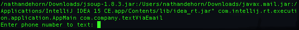

# emailText
A simple way to send text messages via email by just providing the number.

This project uses the JSoup [link](http://jsoup.org/) and JavaMail [link](http://www.oracle.com/technetwork/java/javamail/index.html) Libraries.